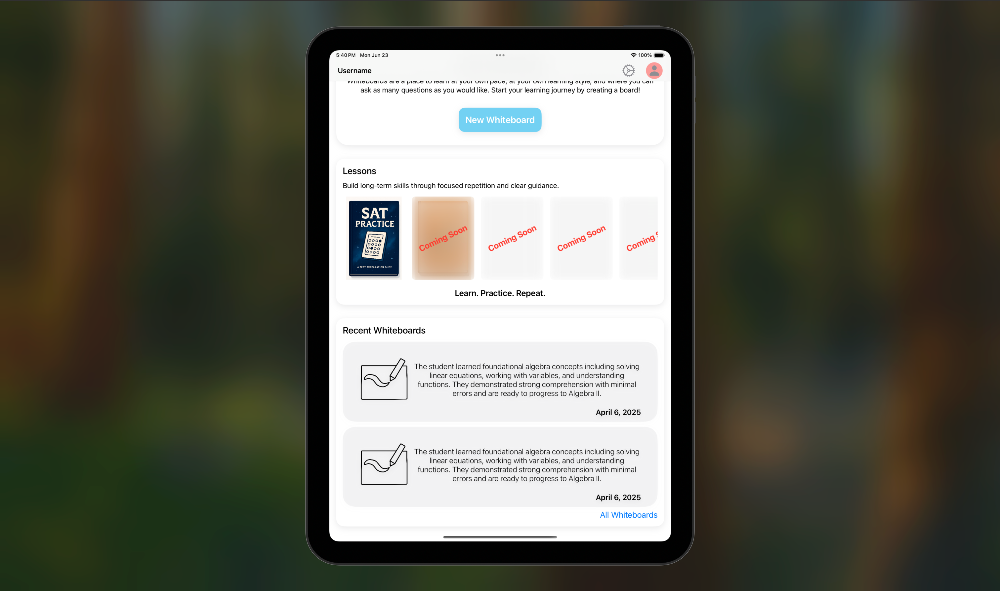

## 📱 Project 2: iOS App Home Page Redesign

**Role**: Designer & iOS Developer  
**Tech Stack**: Swift, SwiftUI, MySQL

### Overview
Redesigned and built a modern home page for an iOS application. I first created the design in Figma based on the client’s vision, then implemented it using SwiftUI while connecting it to existing backend data.

### Features
- Clean, minimalistic interface optimized for mobile UX
- Dynamic data fetching from a MySQL database
- Fully responsive layout using SwiftUI’s layout system
- Smooth UI transitions and custom components

### Outcome
The new home page improved first impressions and usability, aligning the product's visual identity with modern UI standards while remaining lightweight and functional.

